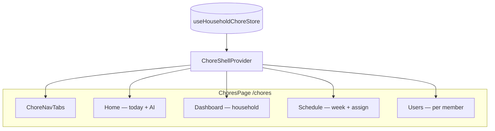

# FamilySite 491 — Client handoff package

**Project:** Household kiosk web app (React + TypeScript + Tailwind CSS)  
**Deliverable focus:** Chore schedule kiosk at `/chores`  
**Package date:** May 2026

---

## What you received

| Item | Location |
| --- | --- |
| Production build (static site) | `handoff/dist/` |
| Documentation | `handoff/docs/` |
| Screenshot capture guide | `handoff/docs/PAGES_AND_SCREENSHOTS.md` |
| This index | `handoff/README.md` |
| Package manifest | `handoff/MANIFEST.json` (file counts, doc list, generated date) |
| Screenshot placeholders | `handoff/screenshots/` |

The full source repository remains at the project root if your team continues development.

**Regenerate package:** from source repo run `npm run handoff` → refreshes `handoff/dist/` and `handoff/docs/`.

---

## Quick start (client / IT)

```bash
# Option A — use the pre-built package (no Node required to host)
cd handoff/dist
npx --yes serve -l 4173
# Open http://localhost:4173/chores

# Option B — rebuild from source
cd /path/to/491WD2
npm ci
npm run build
npm run start
```

---

## Documentation map

| Document | Contents |
| --- | --- |
| [BUILD_AND_DEPLOY.md](./BUILD_AND_DEPLOY.md) | `npm` scripts, hosting, SPA routing, PWA |
| [COMPONENT_REFERENCE.md](./COMPONENT_REFERENCE.md) | All chore components: props, state, interactions |
| [PAGES_AND_SCREENSHOTS.md](./PAGES_AND_SCREENSHOTS.md) | Home, Dashboard, Schedule, Users — flows + screenshot list |
| [UX_GUIDE.md](./UX_GUIDE.md) | Design tokens, motion, touch, real-time behavior |
| [ACCESSIBILITY.md](./ACCESSIBILITY.md) | Audit results, WCAG notes, recommendations |
| [AI_AND_PERSONALIZATION.md](./AI_AND_PERSONALIZATION.md) | Smart suggestions & greeting rules |
| [STATE_AND_DATA.md](./STATE_AND_DATA.md) | localStorage keys, store, cross-tab sync |

---

## Chore app at a glance



**Brand colors:** `#FFD522` `#FF4B6C` `#C516E1` `#735DFF` `#1D1136` `#FFFFFF`

**Touch minimum:** 76 CSS pixels (~20 mm) on primary controls.

---

## Key URLs (after deploy)

| URL | Screen |
| --- | --- |
| `/` | Household home hub |
| `/chores` | Chore kiosk (4 tabs) |
| `/chores?analytics=1` | Chore kiosk + analytics console |

---

## Support checklist for acceptance

- [ ] `handoff/dist/index.html` loads on your host with SPA fallback configured
- [ ] `/chores` shows Home, Dashboard, Schedule, Users tabs
- [ ] Completing a task on Home updates Dashboard counts without refresh
- [ ] Assign board drag-and-drop works on tablet
- [ ] Keyboard: Tab reaches all tabs and modal fields; Escape closes edit dialog
- [ ] Screenshots captured per `PAGES_AND_SCREENSHOTS.md` (client marketing optional)

---

## Contact / handoff notes

- TypeScript **strict** mode; run `npm run typecheck` before any release build.
- No external AI API — suggestions are client-side heuristics.
- Data persists in browser **localStorage** (per device); not a shared cloud database unless you integrate Supabase separately in Settings.
